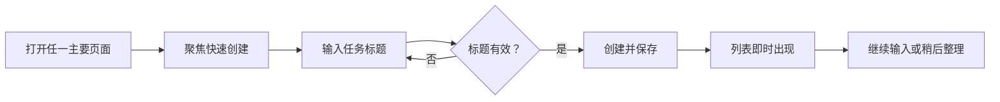
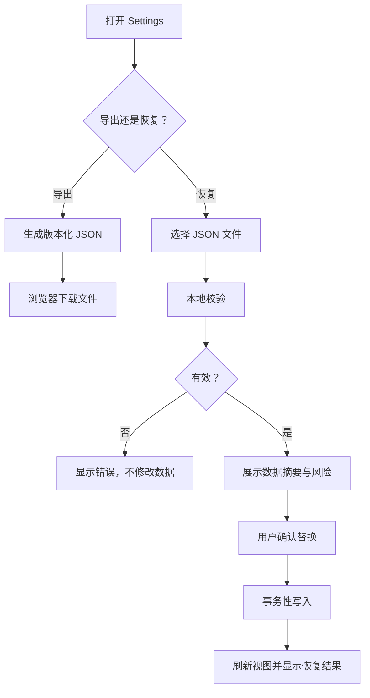

# 用户流程与页面规格

> 文档状态：MVP 基线
> 目标：定义信息架构、页面责任、关键状态和高频交互；不规定最终视觉品牌

## 1. 信息架构

```text
应用
├── Inbox
├── Today
├── Upcoming
├── Projects
│   └── Project Detail
├── Tags
│   └── Tag Detail
├── Completed
└── Settings
    ├── Appearance
    ├── Data Export
    └── Data Restore
```

推荐路由：

| 页面 | 路由 |
|---|---|
| Inbox | `/inbox` |
| Today | `/today` |
| Upcoming | `/upcoming` |
| 项目详情 | `/projects/:projectId` |
| 标签详情 | `/tags/:tagId` |
| Completed | `/completed` |
| Settings | `/settings` |

首次访问默认进入 `/today`；首次使用且没有任务时，通过空状态引导创建第一项任务。

## 2. 全局布局

### 2.1 桌面端

```text
┌──────────────┬──────────────────────────┬────────────────────┐
│ 侧边导航     │ 当前视图 / 任务列表      │ 任务详情（按需）   │
│ Inbox        │ 标题、筛选、快速创建     │ 标题、备注、日期   │
│ Today        │ 分组任务                 │ 项目、标签、操作   │
│ Upcoming     │                          │                    │
│ Projects     │                          │                    │
│ Tags         │                          │                    │
│ Completed    │                          │                    │
└──────────────┴──────────────────────────┴────────────────────┘
```

- 详情面板默认关闭，打开后不改变当前列表上下文。
- 列表宽度优先保证标题可读；次要元信息允许折叠。
- 全局搜索位于主区域顶部或命令入口中。

### 2.2 移动端

- 主导航使用底部导航或可达的抽屉，至少直接暴露 Today、Inbox、Upcoming。
- 任务详情以全屏页面或底部抽屉打开。
- 快速创建按钮保持在单手可达区域。
- 项目、标签、Completed 和 Settings 可以进入“更多”。

## 3. 核心流程

### FLOW-01 快速收集



规则：

- Inbox 创建：`inbox = true`，不自动设置日期。
- Today 创建：`inbox = false`，`plannedDate = today`。
- 项目页创建：自动带入当前项目，`inbox = false`。
- 标签页创建：自动带入当前标签；若没有其他整理字段，保持 `inbox = true`。
- 创建失败时保留用户输入并提示重试。

### FLOW-02 整理 Inbox

```text
打开 Inbox
  → 选择任务
  → 补充项目、标签、重要性、紧急性、计划日期或截止日期
  → 系统标记为已整理
  → 任务退出 Inbox
  → 仍可在对应视图中找到
```

为任务设置项目或计划日期时，默认把 `inbox` 改为 `false`；只添加备注、重要性、紧急性或标签时，不自动移出 Inbox。

### FLOW-03 制订今日计划

```text
打开 Today
  → 先处理逾期截止
  → 查看今日截止
  → 查看未完成结转
  → 从 Inbox/Upcoming 中选择额外任务加入今天
  → 根据重要性和紧急性判断关注顺序
  → 开始执行
```

将任务加入今天只改变 `plannedDate`，不能改写 `deadline`。

### FLOW-04 完成与撤销

```text
点击完成
  → 任务退出当前活动列表
  → 显示“已完成”反馈和撤销按钮
  → 未撤销则进入 Completed
  → 撤销则恢复原计划、截止、项目和标签
```

### FLOW-05 删除与撤销

高频单任务删除不弹确认框，采用软删除并提供短时撤销。删除项目、删除正在使用的标签、导入替换数据等高影响操作必须展示影响范围并确认。

### FLOW-06 导出与恢复



## 4. 页面规格

### 4.1 Inbox

目的：容纳尚未整理的任务。

主要元素：

- 页面标题与未整理数量。
- 快速创建输入框。
- 任务列表。
- 空状态：“这里用于临时收集，先记下来，稍后再整理。”

默认排序：手动顺序（如尚未实现拖拽，则按创建时间倒序）。

主要操作：创建、打开详情、完成、删除、批量标记为已整理（批量能力可延后）。

### 4.2 Today

目的：展示今天真正需要关注的有限任务集合。

固定分组顺序：

1. 逾期截止
2. 今日截止
3. 未完成结转
4. 今日计划

同一任务只出现一次。归组优先级为逾期截止 > 今日截止 > 未完成结转 > 今日计划。

列表项应区分：

- “计划今天”标识。
- “今天截止”或“已逾期 N 天”标识。
- 重要性和紧急性系统标识。
- 项目颜色或名称。

空状态不使用“没有任务”这类消极文案，建议：“今天还没有安排。可以从 Inbox 或 Upcoming 选择，也可以直接创建。”

### 4.3 Upcoming

目的：展示明日起未来 7 个自然日的计划和截止任务。

页面结构：

- 按日期分组。
- 每组显示计划任务数和截止任务数。
- 无任务日期可以隐藏；若连续为空，显示整体空状态。
- 任务同时计划和截止在同一天时只显示一次，并显示两个语义。
- 计划日期和截止日期不同时，只在较早的相关日期出现一次，并在任务元信息中继续显示另一个日期。

MVP 不做月历网格和拖拽改期；点击日期字段修改。

### 4.4 Project Detail

目的：展示属于某一项目的全部活动任务。

主要元素：项目名称、颜色、归档入口、快速创建、活动任务、已完成折叠区或跳转。

默认排序：未设日期在后；有日期按 `plannedDate`、`deadline` 排序。用户可以切换为四象限排序。

归档项目时：

- 说明项目将从默认导航和选择器隐藏。
- 不删除项目内任务。
- 原任务仍出现在 Today、Upcoming、搜索和 Completed。

### 4.5 Tag Detail

目的：跨项目查看具有同一标签的任务。

主要元素：标签名称、任务数量、快速创建、基础筛选。

删除标签前展示关联任务数量；确认后只从任务的 `tagIds` 中移除该标签。

### 4.6 Completed

目的：提供完成记录和误操作恢复。

主要元素：搜索、按完成日期分组、项目/标签筛选、恢复操作。

默认排序：`completedAt` 倒序。默认不加载软删除任务。

### 4.7 Settings

MVP 设置项：

- 主题：跟随系统 / 浅色 / 深色。
- 周起始日：周一 / 周日。
- 数据统计摘要：活动任务、已完成、项目、标签数量。
- 导出数据。
- 从备份恢复。
- 应用版本和数据 schema 版本。

## 5. 任务列表项

默认可见：

- 完成复选框。
- 标题。
- 计划日期或截止日期中的关键状态。
- 已设置的重要性和紧急性标识；系统分类与普通标签采用可区分的样式或前缀。
- 项目标识。
- 最多显示两个标签，其余折叠为数量。

交互：

- 点击复选框：完成/恢复。
- 点击标题或空白区域：打开详情。
- 更多菜单：加入今天、改期、移回 Inbox、删除。
- 不允许点击日期区域意外完成任务。

## 6. 任务详情

字段顺序：

1. 完成状态
2. 标题
3. 备注
4. 计划日期
5. 截止日期
6. 重要性：未设置 / 重要 / 不重要
7. 紧急性：未设置 / 紧急 / 不紧急
8. 项目
9. 标签
10. 创建/更新时间
11. 删除操作

计划日期和截止日期必须配有帮助文本：

- 计划日期：你准备在哪一天处理它。
- 截止日期：它最晚必须在哪一天完成。

桌面可自动保存明确的单字段更改；标题和备注采用失焦或显式保存。若实现自动保存，必须有保存中、已保存、失败三种反馈，不允许无反馈静默失败。

## 7. 搜索与筛选

- `/` 聚焦搜索。
- 输入后防抖查询标题和备注。
- 搜索结果显示命中位置的上下文，但不得使用不安全 HTML 注入高亮。
- 筛选项：状态、重要性、紧急性、四象限、未分类、项目、标签。
- 选择“重要”时匹配所有重要任务，不限制紧急性；选择完整象限时两个条件使用 AND。
- 任何一个维度为“未设置”的任务进入“未分类”筛选，不进入四个完整象限。
- 排序项：计划日期、截止日期、四象限、创建时间。
- 搜索条件反映在 URL query 中属于 P1；MVP 可以仅保存在页面状态。

## 8. 空状态、加载状态与错误状态

每个页面都必须定义：

- 空状态：说明该页面用途并提供一个主操作。
- 加载状态：避免列表布局大幅跳动。
- 错误状态：说明数据读取或保存失败，并提供重试。
- 离线状态：顶部非阻断提示“当前离线，修改将保存在本设备”。

## 9. 键盘规则

| 按键 | 行为 |
|---|---|
| `n` | 聚焦快速创建；输入框或编辑器中不触发 |
| `/` | 聚焦搜索；输入框或编辑器中不触发 |
| `Enter` | 提交快速创建；详情多行备注中仅换行 |
| `Esc` | 关闭详情、退出菜单或取消未保存编辑 |
| `Space` | 聚焦复选框时切换完成状态 |

所有快捷键必须有菜单或可点击替代路径。

## 10. 文案规则

- 使用“计划日期”和“截止日期”，不使用含糊的“日期”。
- 使用“完成”而不是“关闭任务”。
- 使用“恢复数据”而不是“导入覆盖”，同时在确认界面明确会替换现有数据。
- 错误消息说明发生了什么、数据是否安全、用户下一步能做什么。
- 不用羞辱或制造焦虑的逾期文案。
