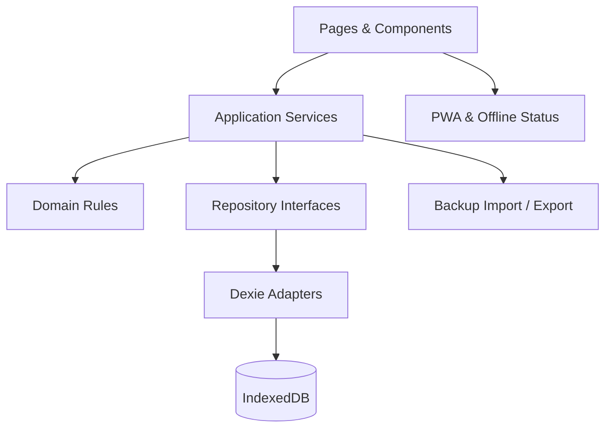

# 技术设计

> 文档状态：MVP 基线
> 产品形态：响应式 Web/PWA
> 架构方向：Local-first、单页应用、领域逻辑与存储隔离

## 1. 技术目标

- 无账号和后端也能完成全部 MVP 操作。
- 应用加载后可离线使用核心功能。
- 数据结构可版本化迁移和导出恢复。
- 领域规则可独立测试，不依赖 React 组件。
- 将来增加云同步时，不推翻页面和领域层。

## 2. 推荐技术栈

| 层 | 选择 | 用途 |
|---|---|---|
| 语言 | TypeScript | 统一领域、UI、校验类型 |
| UI | React | 组件化页面与交互 |
| 构建 | Vite | 本地开发与生产构建 |
| 路由 | React Router | 页面和详情路由 |
| 样式 | Tailwind CSS 或项目级 CSS Tokens | 响应式布局与设计约束 |
| 本地数据库 | IndexedDB + Dexie | 结构化、可索引、事务性本地存储 |
| 运行时校验 | Zod | 表单边界和备份文件校验 |
| 日期 | date-fns 或自建受测 LocalDate 工具 | 自然日计算，避免时区歧义 |
| 单元/组件测试 | Vitest + React Testing Library | 领域与组件行为 |
| 端到端测试 | Playwright | 真实浏览器核心闭环 |
| PWA | Vite PWA 插件或等价方案 | Manifest、Service Worker、缓存更新 |

约束：开始实现时锁定版本并提交 lockfile；不要在没有明确用途时增加状态管理、请求缓存或 UI 大型组件库。

## 3. 架构



职责：

- Pages/Components：呈现和用户输入，不包含数据库查询细节。
- Application Services：编排创建、完成、删除、恢复、导入等用例。
- Domain Rules：标题规范、日期归组、状态转换、不变量。
- Repository Interfaces：定义领域需要的数据访问能力。
- Dexie Adapters：索引查询、事务和实体映射。
- Backup：版本化序列化、校验、预览和事务恢复。

## 4. 目录结构

```text
src/
├── app/
│   ├── router.tsx
│   ├── providers.tsx
│   └── App.tsx
├── pages/
│   ├── InboxPage.tsx
│   ├── TodayPage.tsx
│   ├── UpcomingPage.tsx
│   ├── ProjectPage.tsx
│   ├── TagPage.tsx
│   ├── CompletedPage.tsx
│   └── SettingsPage.tsx
├── features/
│   ├── task-create/
│   ├── task-detail/
│   ├── task-list/
│   ├── search-filter/
│   └── backup-restore/
├── domain/
│   ├── task/
│   │   ├── task.types.ts
│   │   ├── task.rules.ts
│   │   └── task.service.ts
│   ├── project/
│   ├── tag/
│   └── date/
├── data/
│   ├── db.ts
│   ├── migrations/
│   ├── repositories/
│   └── backup/
├── components/
│   ├── ui/
│   └── layout/
├── hooks/
├── styles/
└── test/
    ├── fixtures/
    └── helpers/
```

测试文件可以与实现同目录或放在 `test/`，但项目内必须统一。

## 5. 状态管理

MVP 不引入大型全局状态框架作为默认选择。

- 持久业务状态：IndexedDB。
- 视图查询：Repository + Dexie 响应式查询 hook。
- 表单草稿：组件本地状态。
- 全局轻状态：主题、离线提示、Toast、当前详情面板。
- URL 状态：当前页面和实体 ID。

若后续出现跨页面复杂临时状态，再通过 ADR/决策记录评估 Zustand 等方案。

## 6. 数据访问

UI 禁止直接调用：

```ts
db.tasks.put(...)
db.tasks.where(...)
```

UI 应调用：

```ts
taskService.create(...)
taskService.complete(...)
taskQueries.useToday(...)
```

这样可以集中实现：

- 标题和日期校验。
- 时间戳。
- Inbox 自动规则。
- 完成/恢复状态转换。
- 错误标准化。
- 将来本地与云端实现切换。

## 7. 日期与时区

- `plannedDate` 和 `deadline` 保存为 `YYYY-MM-DD`。
- `createdAt`、`updatedAt`、`completedAt`、`deletedAt` 保存为 UTC ISO 时间。
- Today 边界以当前设备时区计算。
- 所有 LocalDate 解析、比较和加减集中在 `domain/date`。
- 单元测试必须覆盖月末、年末、闰年和夏令时地区；即使中国时区无 DST，也不能依赖运行机器环境。

## 8. PWA 与离线策略

### 8.1 缓存

缓存应用壳：HTML、JS、CSS、图标和必要字体。任务数据只在 IndexedDB 中，不进入 Service Worker Cache。

### 8.2 更新

- 检测到新版本时提示用户刷新。
- 有未保存表单时不自动刷新。
- 更新失败时继续使用当前缓存版本。

### 8.3 离线状态

- `navigator.onLine` 仅用于提示，不作为能否保存的依据。
- 本地数据库可用时，离线创建、编辑和完成正常工作。
- MVP 没有服务器同步队列。

## 9. 搜索实现

MVP 搜索范围为标题和备注：

1. 输入标准化：trim、大小写折叠。
2. 150–250ms 防抖。
3. 先查询符合页面状态范围的任务，再对标题和备注做包含匹配。
4. 5,000 条规模出现性能问题时，再引入预计算字段或全文索引；不提前增加复杂索引库。

搜索高亮必须通过文本节点切分实现，禁止使用未经处理的 `dangerouslySetInnerHTML`。

## 10. 备份与恢复

模块：

- `serializeBackup()`：从一致性快照生成 `BackupEnvelopeV1`。
- `validateBackup()`：Zod 结构校验 + 跨实体引用校验。
- `summarizeBackup()`：生成确认页摘要。
- `restoreBackup()`：单事务替换写入。

安全限制：

- 文件大小默认上限 20 MB，可根据实测调整。
- JSON 解析失败不修改数据。
- 未知 schema 版本不尝试猜测导入。
- 恢复前在 UI 提醒用户先导出当前数据。
- 事务失败回滚全部表。

## 11. 错误处理

定义应用错误类别：

```ts
type AppErrorCode =
  | 'VALIDATION_ERROR'
  | 'NOT_FOUND'
  | 'STORAGE_READ_FAILED'
  | 'STORAGE_WRITE_FAILED'
  | 'MIGRATION_FAILED'
  | 'BACKUP_INVALID'
  | 'BACKUP_UNSUPPORTED_VERSION'
  | 'BACKUP_RESTORE_FAILED'
```

原则：

- 领域层抛出结构化错误，不携带 UI 文案。
- UI 将错误映射为用户可理解的信息。
- 保存失败时保留草稿。
- 不以 Toast 作为唯一错误载体；阻断错误需要页面内提示。
- 生产日志不记录任务标题、备注或备份内容。

## 12. 安全与隐私

- 任务备注仅按纯文本渲染。
- 不使用第三方分析脚本记录业务内容。
- Content Security Policy 至少限制脚本来源为自身部署域。
- 依赖安装后运行安全审计，但不以自动升级破坏 lockfile 稳定性。
- 导出文件由用户主动下载，不上传到远端。
- 应用设置页明确说明“清除浏览器站点数据会删除本地任务，请定期导出备份”。

## 13. 可访问性

- 使用语义化 `button`、`input`、`dialog`/合适的弹层结构。
- 完成复选框有任务标题关联的可访问名称。
- 打开详情时正确移动焦点，关闭时将焦点还给触发元素。
- Toast 使用适当 live region，但避免对每次输入过度播报。
- 色彩对比、焦点样式和触控尺寸进入 UI 验收。

## 14. 测试策略

### 14.1 单元测试

- 标题和字段校验。
- Today 分组和去重。
- Upcoming 日期窗口。
- 重要性/紧急性互斥值、四象限派生和未分类判断。
- 完成/恢复/删除状态转换。
- Inbox 自动规则。
- 导入 schema 和引用校验。
- 本地日期边界。

### 14.2 Repository 集成测试

- Dexie 测试数据库 CRUD。
- 多值标签查询。
- 项目归档不丢任务。
- 删除标签事务性移除引用。
- 恢复备份事务回滚。
- schema migration。

### 14.3 组件测试

- 快速创建输入。
- 任务详情校验和取消。
- Today 四分组渲染。
- 搜索筛选。
- 重要性、紧急性和四象限筛选控件。
- 导入确认界面。

### 14.4 端到端测试

- 创建 → 刷新 → 编辑 → 完成 → 恢复。
- Inbox 整理到项目和 Today。
- Today 计划与 deadline 独立。
- 设置重要性/紧急性并按单一维度、完整象限和未分类筛选。
- 导出 → 在隔离测试库恢复 → 数据一致。
- 离线加载应用壳并创建任务。
- 360px 移动端核心流程。

## 15. 开发阶段

### Phase 0：工程骨架

初始化、路由、样式 Tokens、Dexie、测试、PWA 基础。

### Phase 1：第一个纵向闭环

创建任务 → 保存 → 列表显示 → 刷新保留 → 完成 → 恢复。

### Phase 2：日期与 Today

`plannedDate`、`deadline`、四分组、Upcoming。

### Phase 3：组织与查找

项目、标签、重要性/紧急性分类、搜索、筛选、Completed。

### Phase 4：数据安全与适配

导出恢复、迁移验证、移动端、离线和可访问性。

每个阶段完成后才进入下阶段，不采用“先生成所有页面再补逻辑”的方式。

## 16. CI 质量门禁

每次合并至少运行：

```text
format/check
lint
typecheck
unit tests
production build
```

发布候选还需运行端到端核心场景。实际命令在项目初始化后写入 `package.json` 和 README，本文不预设不存在的脚本名。

## 17. 部署

- MVP 可部署为静态站点。
- 必须启用 HTTPS，以支持 Service Worker/PWA。
- SPA 路由需配置回退到 `index.html`。
- 不部署数据库或任务 API。
- 部署不是项目创建后的自动动作；在测试和验收通过后由用户明确发起。

## 18. 待验证技术风险

| 风险 | 验证方式 | 处理方向 |
|---|---|---|
| Safari IndexedDB 存储清理 | 真机长期测试、持久化 API 调研 | 强化导出提醒 |
| Service Worker 旧版本缓存 | 更新场景 E2E | 显式版本提示 |
| 5,000 条任务搜索卡顿 | 基准数据测试 | 预计算/索引 |
| 导入大文件阻塞主线程 | 20 MB 压力测试 | Worker 或流式处理 |
| 本地日期跨时区变化 | 修改系统时区测试 | 明确自然日语义 |
