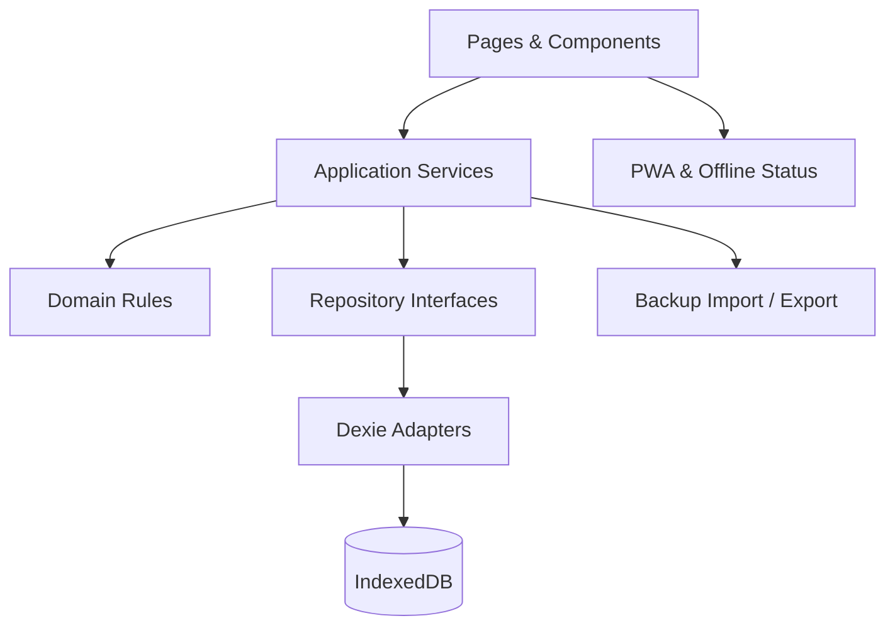
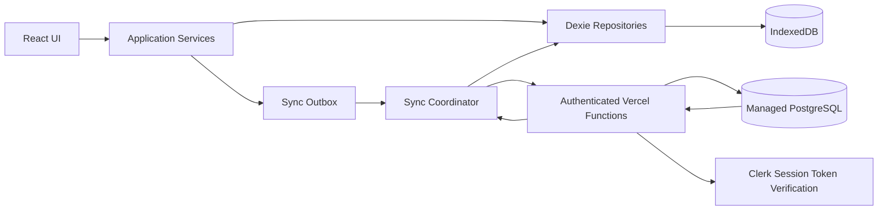

# 技术设计

> 文档状态：MVP 基线 + Phase 5 已批准范围
> 产品形态：响应式 Web/PWA
> 架构方向：Local-first、单页应用、领域逻辑与存储隔离；Phase 5 增加鉴权 API 与云端 PostgreSQL

## 1. 技术目标

- 无账号和后端也能完成全部本地操作；云同步是可选增强。
- 应用加载后可离线使用核心功能。
- 数据结构可版本化迁移和导出恢复。
- 领域规则可独立测试，不依赖 React 组件。
- 将来增加云同步时，不推翻页面和领域层。

## 2. 推荐技术栈

| 层 | 选择 | 用途 |
|---|---|---|
| 语言 | TypeScript | 统一领域、UI、校验类型 |
| UI | React | 组件化页面与交互 |
| 构建 | Vite | 本地开发与生产构建 |
| 路由 | React Router | 页面和详情路由 |
| 样式 | Tailwind CSS 或项目级 CSS Tokens | 响应式布局与设计约束 |
| 本地数据库 | IndexedDB + Dexie | 结构化、可索引、事务性本地存储 |
| 运行时校验 | Zod | 表单边界和备份文件校验 |
| 日期 | date-fns 或自建受测 LocalDate 工具 | 自然日计算，避免时区歧义 |
| 单元/组件测试 | Vitest + React Testing Library | 领域与组件行为 |
| 端到端测试 | Playwright | 真实浏览器核心闭环 |
| PWA | Vite PWA 插件或等价方案 | Manifest、Service Worker、缓存更新 |

Phase 5 增量技术栈：

| 层 | 选择 | 用途 |
|---|---|---|
| 服务端入口 | Vercel Functions（TypeScript） | 鉴权后的同步 API；不把数据库凭据暴露给浏览器 |
| 云数据库 | Vercel Marketplace 中的 Neon Postgres | 用户隔离、事务、版本与删除墓碑 |
| SQL 访问 | `@neondatabase/serverless` + 版本化 SQL migration | 参数化查询、无服务器连接、事务与可审计 schema 变更 |
| 认证 | Clerk React SDK + `@clerk/backend` | React SPA 登录、服务端 session token 校验与 API 保护 |
| 边界校验 | Zod 或现有等价方案 | API、同步协议、环境变量和数据库结果校验 |

Phase 5A spike 已锁定 Clerk 与 Neon Serverless Driver，详见 D-017。Clerk Marketplace 注入 `NEXT_PUBLIC_CLERK_PUBLISHABLE_KEY`；Vite 只额外公开 `NEXT_PUBLIC_` 前缀，`CLERK_SECRET_KEY` 仍严格保留在服务端。Clerk 的 `userId` 只能由服务端验证后的会话取得；客户端提供的 owner/userId 一律忽略。当前应用不应仅为了接入认证而从 Vite 迁移到 Next.js。

Clerk 开发实例的 SDK 遥测在服务端显式关闭；后续接入 `ClerkProvider` 时也必须沿用相同选择，避免把产品使用事件作为同步功能的隐含前提。

约束：开始实现时锁定版本并提交 lockfile；不要在没有明确用途时增加状态管理、请求缓存或 UI 大型组件库。

## 3. 架构



Phase 5 在 Repository/Application Service 边界之后增加同步能力：



IndexedDB 继续承担即时 UI、离线编辑和本地查询；PostgreSQL 承担跨设备持久化和版本事实。UI 仍不直接访问 Dexie，也不直接连接 PostgreSQL。

职责：

- Pages/Components：呈现和用户输入，不包含数据库查询细节。
- Application Services：编排创建、完成、删除、恢复、导入等用例。
- Domain Rules：标题规范、日期归组、状态转换、不变量。
- Repository Interfaces：定义领域需要的数据访问能力。
- Dexie Adapters：索引查询、事务和实体映射。
- Backup：版本化序列化、校验、预览和事务恢复。

## 4. 目录结构

```text
src/
├── app/
│   ├── router.tsx
│   ├── providers.tsx
│   └── App.tsx
├── pages/
│   ├── InboxPage.tsx
│   ├── TodayPage.tsx
│   ├── UpcomingPage.tsx
│   ├── ProjectPage.tsx
│   ├── TagPage.tsx
│   ├── CompletedPage.tsx
│   └── SettingsPage.tsx
├── features/
│   ├── task-create/
│   ├── task-detail/
│   ├── task-list/
│   ├── search-filter/
│   └── backup-restore/
├── domain/
│   ├── task/
│   │   ├── task.types.ts
│   │   ├── task.rules.ts
│   │   └── task.service.ts
│   ├── project/
│   ├── tag/
│   └── date/
├── data/
│   ├── db.ts
│   ├── migrations/
│   ├── repositories/
│   └── backup/
├── components/
│   ├── ui/
│   └── layout/
├── hooks/
├── styles/
└── test/
    ├── fixtures/
    └── helpers/
```

测试文件可以与实现同目录或放在 `test/`，但项目内必须统一。

Phase 5 追加 `api/`（Vercel Functions）、`src/sync/`（协议、outbox、协调器、冲突）和独立的数据库 migration 目录；API 不能导入浏览器专用模块，前后端只共享无运行时副作用的 schema 与类型。

## 5. 状态管理

MVP 不引入大型全局状态框架作为默认选择。

- 持久业务状态：IndexedDB。
- 视图查询：Repository + Dexie 响应式查询 hook。
- 表单草稿：组件本地状态。
- 全局轻状态：主题、离线提示、Toast、当前详情面板。
- URL 状态：当前页面和实体 ID。
- 同步瞬时状态：由独立 Sync Coordinator 暴露为只读状态，不复制完整任务集合到全局状态库。

若后续出现跨页面复杂临时状态，再通过 ADR/决策记录评估 Zustand 等方案。

## 6. 数据访问

UI 禁止直接调用：

```ts
db.tasks.put(...)
db.tasks.where(...)
```

UI 应调用：

```ts
taskService.create(...)
taskService.complete(...)
taskQueries.useToday(...)
```

这样可以集中实现：

- 标题和日期校验。
- 时间戳。
- Inbox 自动规则。
- 完成/恢复状态转换。
- 错误标准化。
- 将来本地与云端实现切换。

## 7. 日期与时区

- `plannedDate` 和 `deadline` 保存为 `YYYY-MM-DD`。
- `createdAt`、`updatedAt`、`completedAt`、`deletedAt` 保存为 UTC ISO 时间。
- Today 边界以当前设备时区计算。
- 所有 LocalDate 解析、比较和加减集中在 `domain/date`。
- 单元测试必须覆盖月末、年末、闰年和夏令时地区；即使中国时区无 DST，也不能依赖运行机器环境。

## 8. PWA 与离线策略

### 8.1 缓存

缓存应用壳：HTML、JS、CSS、图标和必要字体。任务数据只在 IndexedDB 中，不进入 Service Worker Cache。

### 8.2 更新

- 检测到新版本时提示用户刷新。
- 有未保存表单时不自动刷新。
- 更新失败时继续使用当前缓存版本。

### 8.3 离线状态

- `navigator.onLine` 仅用于提示，不作为能否保存的依据。
- 本地数据库可用时，离线创建、编辑和完成正常工作。
- MVP 基线没有服务器同步队列；Phase 5 启用同步后，每次业务写入与 outbox 必须在同一个本地事务中完成。

## 9. 搜索实现

MVP 搜索范围为标题和备注：

1. 输入标准化：trim、大小写折叠。
2. 150–250ms 防抖。
3. 先查询符合页面状态范围的任务，再对标题和备注做包含匹配。
4. 5,000 条规模出现性能问题时，再引入预计算字段或全文索引；不提前增加复杂索引库。

搜索高亮必须通过文本节点切分实现，禁止使用未经处理的 `dangerouslySetInnerHTML`。

## 10. 备份与恢复

模块：

- `serializeBackup()`：从一致性快照生成 `BackupEnvelopeV1`。
- `validateBackup()`：Zod 结构校验 + 跨实体引用校验。
- `summarizeBackup()`：生成确认页摘要。
- `restoreBackup()`：单事务替换写入。

安全限制：

- 文件大小默认上限 20 MB，可根据实测调整。
- JSON 解析失败不修改数据。
- 未知 schema 版本不尝试猜测导入。
- 恢复前在 UI 提醒用户先导出当前数据。
- 事务失败回滚全部表。

## 11. 错误处理

定义应用错误类别：

```ts
type AppErrorCode =
  | 'VALIDATION_ERROR'
  | 'NOT_FOUND'
  | 'STORAGE_READ_FAILED'
  | 'STORAGE_WRITE_FAILED'
  | 'MIGRATION_FAILED'
  | 'BACKUP_INVALID'
  | 'BACKUP_UNSUPPORTED_VERSION'
  | 'BACKUP_RESTORE_FAILED'
  | 'AUTH_REQUIRED'
  | 'SYNC_NETWORK_FAILED'
  | 'SYNC_REJECTED'
  | 'SYNC_CONFLICT'
  | 'SYNC_PROTOCOL_UNSUPPORTED'
  | 'SYNC_BOOTSTRAP_BLOCKED'
```

原则：

- 领域层抛出结构化错误，不携带 UI 文案。
- UI 将错误映射为用户可理解的信息。
- 保存失败时保留草稿。
- 不以 Toast 作为唯一错误载体；阻断错误需要页面内提示。
- 生产日志不记录任务标题、备注或备份内容。

## 12. 安全与隐私

- 任务备注仅按纯文本渲染。
- 不使用第三方分析脚本记录业务内容。
- Content Security Policy 至少限制脚本来源为自身部署域。
- 依赖安装后运行安全审计，但不以自动升级破坏 lockfile 稳定性。
- 导出文件由用户主动下载，不自动上传到远端；Phase 5 上传的是用户明确启用同步后的受验证业务数据。
- 应用设置页明确说明“清除浏览器站点数据会删除本地任务，请定期导出备份”。
- 数据库连接串、服务端密钥和认证私钥只能存在于服务端环境变量，禁止使用会暴露进 Vite 客户端包的变量前缀。
- API 从验证后的会话获得用户 ID，忽略客户端提交的 owner/user 字段。
- 生产日志和错误监控不得包含任务标题、备注、搜索词或同步 payload。

## 13. 可访问性

- 使用语义化 `button`、`input`、`dialog`/合适的弹层结构。
- 完成复选框有任务标题关联的可访问名称。
- 打开详情时正确移动焦点，关闭时将焦点还给触发元素。
- Toast 使用适当 live region，但避免对每次输入过度播报。
- 色彩对比、焦点样式和触控尺寸进入 UI 验收。

## 14. 测试策略

### 14.1 单元测试

- 标题和字段校验。
- Today 分组和去重。
- Upcoming 日期窗口。
- 重要性/紧急性互斥值、四象限派生和未分类判断。
- 完成/恢复/删除状态转换。
- Inbox 自动规则。
- 导入 schema 和引用校验。
- 本地日期边界。

### 14.2 Repository 集成测试

- Dexie 测试数据库 CRUD。
- 多值标签查询。
- 项目归档不丢任务。
- 删除标签事务性移除引用。
- 恢复备份事务回滚。
- schema migration。

### 14.3 组件测试

- 快速创建输入。
- 任务详情校验和取消。
- Today 四分组渲染。
- 搜索筛选。
- 重要性、紧急性和四象限筛选控件。
- 导入确认界面。

### 14.4 端到端测试

- 创建 → 刷新 → 编辑 → 完成 → 恢复。
- Inbox 整理到项目和 Today。
- Today 计划与 deadline 独立。
- 设置重要性/紧急性并按单一维度、完整象限和未分类筛选。
- 导出 → 在隔离测试库恢复 → 数据一致。
- 离线加载应用壳并创建任务。
- 360px 移动端核心流程。

### 14.5 Phase 5 专项测试

- 单元：outbox 状态转换、可重试错误分类、退避上限、revision 冲突、删除墓碑、同步状态文案。
- 本地集成：业务写入与 outbox 原子性、游标与拉取页原子性、Dexie schema migration、异常关闭恢复。
- API/数据库集成：认证缺失、跨用户 ID、伪造 owner、mutation 幂等、批次事务、bootstrap 重试、引用隔离和协议版本拒绝。
- E2E：两个浏览器上下文首次迁移、双向修改、离线恢复、会话失效、并发冲突、离线删除后重连。
- 部署验证：Preview 与 Production 环境变量和数据库隔离，客户端构建产物敏感值扫描。

## 15. 开发阶段

### Phase 0：工程骨架

初始化、路由、样式 Tokens、Dexie、测试、PWA 基础。

### Phase 1：第一个纵向闭环

创建任务 → 保存 → 列表显示 → 刷新保留 → 完成 → 恢复。

### Phase 2：日期与 Today

`plannedDate`、`deadline`、四分组、Upcoming。

### Phase 3：组织与查找

项目、标签、重要性/紧急性分类、搜索、筛选、Completed。

### Phase 4：数据安全与适配

导出恢复、迁移验证、移动端、离线和可访问性。

### Phase 5：私有云持久化

Phase 5 必须继续按纵向切片实施：

1. **Phase 5A — 基础设施 spike 与契约**：已选择 Clerk 和 Neon Serverless Driver；建立测试数据库、迁移框架、环境变量校验和同步协议 schema。数据库脚本要求 `DATABASE_ENVIRONMENT=development|test|preview`，不得连接生产数据。
2. **Phase 5B — 账号与只读云端**：完成登录、服务端会话验证、用户隔离测试和空账户增量拉取；本地功能保持不变。
3. **Phase 5C — 首次迁移**：实现云端空账户检测、本地摘要、确认、幂等 bootstrap 和失败恢复。
4. **Phase 5D — 本地写入与双向同步**：实现本地事务 outbox、幂等 push、游标 pull、重试和状态 UI。
5. **Phase 5E — 冲突与删除安全**：实现 revision 冲突、用户选择、删除墓碑、恢复测试和两设备 E2E。

每个子阶段均需关联 `SYNC-001`～`SYNC-006` 的具体条目；不能用“API 已返回 200”代替持久化、刷新、离线和失败状态验收。

每个阶段完成后才进入下阶段，不采用“先生成所有页面再补逻辑”的方式。

## 16. CI 质量门禁

每次合并至少运行：

```text
format/check
lint
typecheck
unit tests
production build
```

发布候选还需运行端到端核心场景。实际命令在项目初始化后写入 `package.json` 和 README，本文不预设不存在的脚本名。

## 17. 部署

- MVP 基线可部署为静态站点；Phase 5 部署将同时包含 Vercel Functions。
- 必须启用 HTTPS，以支持 Service Worker/PWA。
- SPA 路由需配置回退到 `index.html`。
- SPA 回退规则不得捕获 `/api/*`；先验证 Functions 路由，再回退前端页面。
- MVP 基线不部署数据库或任务 API；Phase 5 使用 Vercel Marketplace 托管 PostgreSQL 和受鉴权的任务同步 API。
- 部署不是项目创建后的自动动作；在测试和验收通过后由用户明确发起。

Phase 5 环境要求：

- Development、Preview、Production 使用隔离的数据库或至少隔离的 schema/分支和独立密钥。
- 先在 Vercel 项目中安装数据库集成，再拉取环境变量到本地；任何 `.env*` 实值文件均不得提交 Git。
- Preview 部署不得读取或修改 Production 数据。
- 数据库 migration 在部署流程中单独执行并可审计；应用实例启动时不得并发猜测执行破坏性迁移。
- 应用查询使用池化 `DATABASE_URL`；migration 使用 direct `DATABASE_URL_UNPOOLED`，避免 PgBouncer transaction mode 对 session/DDL 工具造成隐式限制。
- 切换云同步为默认可见前使用功能开关或等价的受控发布方式，并准备停止写入、回退 API 与保留数据的方案。

### 17.1 Phase 5A 验证记录（2026-08-20）

- Vercel 项目已创建同名 `personal-todo-test` Neon 与 Clerk 资源，只连接 Development、Preview；Production 未连接这些资源。
- Development 使用 `DATABASE_ENVIRONMENT=test`，Preview 使用 `DATABASE_ENVIRONMENT=preview`；未标记或 Production 目标会被 migration/集成测试安全门拒绝。
- `0001_phase5a_sync_foundation.sql` 已在测试 Neon 成功应用；再次执行结果为 0 applied / 1 unchanged。
- 数据库连接检查、Clerk 服务端凭据只读检查、双用户查询隔离测试、Function handler health/401 检查均通过。
- `vercel build --target=preview` 已无 TypeScript 错误，产物包含 `api/health.func`、`api/sync/state.func` 和 `api/sync/pull.func`。
- 当前机器上的 Vercel CLI 58.11.0 执行 `vercel dev` 会停在 `Creating initial build`，代理端口无响应；已停止该进程。Phase 5A 使用打包验证与 handler 直调覆盖，后续 Preview 部署验收前仍需复查真实 HTTP 路由。

### 17.2 Phase 5B 验证记录（2026-08-20）

- 设置页接入可选 `ClerkProvider`：没有公共配置时回退本地模式；未登录可打开 Clerk 登录弹窗；登录/退出不删除 IndexedDB 数据。
- 登录后客户端仅并行发起受鉴权的 `GET state` 与首个 `GET pull`，展示本地/云端摘要和“同步尚未启用”；不存在自动 bootstrap、push 或任务 payload 上传路径。
- 服务端先验证 Clerk session，再校验协议并使用会话 `userId` 查询；请求中的伪造 owner 被忽略。`pull` 的 HMAC 游标绑定用户，篡改或跨用户使用均被拒绝。
- `SYNC_CURSOR_SECRET` 已只配置到 Vercel Development 与 Preview；Production 仍未连接 Phase 5 测试资源。migration 使用 direct URL 幂等复跑，结果为 0 applied / 1 unchanged。
- 全量单元/组件测试 67 项通过；Neon 双用户 state/pull 隔离集成测试 2 项通过；format、lint、typecheck、Vite production build 和 Vercel Preview 本地打包通过。
- Playwright 在 Vite 开发页验证设置页无控制台错误，未登录本地模式、数据摘要和 Clerk 登录弹窗均可访问。未代用户完成真实账号登录，因此登录后的真实 HTTP token 往返仍需在 Preview 部署后验收。
- `vercel dev` 3000 代理在当前 CLI/机器上仍停在初始构建；这是本地组合代理限制，不影响已验证的 Vite 页面、Function handler、数据库集成或 Vercel Preview 打包，但真实 Preview URL 路由仍未验收。

## 18. 待验证技术风险

| 风险 | 验证方式 | 处理方向 |
|---|---|---|
| Safari IndexedDB 存储清理 | 真机长期测试、持久化 API 调研 | 强化导出提醒 |
| Service Worker 旧版本缓存 | 更新场景 E2E | 显式版本提示 |
| 5,000 条任务搜索卡顿 | 基准数据测试 | 预计算/索引 |
| 导入大文件阻塞主线程 | 20 MB 压力测试 | Worker 或流式处理 |
| 本地日期跨时区变化 | 修改系统时区测试 | 明确自然日语义 |
| Preview/Production 数据串用 | 检查 Vercel 环境变量作用域、集成测试 | 环境隔离，生产密钥只用于 Production |
| 重复请求造成重复写入 | 超时后重放同一 mutation | `(user_id, mutation_id)` 唯一与幂等返回 |
| 多设备覆盖修改 | 两设备基于同一 revision 并发编辑 | 乐观版本检查与显式冲突解决 |
| 离线删除被旧设备复活 | 一台设备删除、另一台长期离线后上线 | 删除墓碑和游标重建测试 |
| 登录失效导致队列丢失 | 写入后撤销/过期会话 | 队列持久化，重新登录后继续 |
| 服务端日志泄露内容 | 检查日志与错误采集样本 | 结构化元数据白名单，禁止 payload |

## 19. Phase 5 同步 API 契约

首版保持少量、粗粒度且可测试的端点：

```text
GET  /api/sync/state
POST /api/sync/bootstrap/start
POST /api/sync/bootstrap/batch
POST /api/sync/bootstrap/complete
POST /api/sync/push
GET  /api/sync/pull?cursor=<opaque>&limit=<bounded>
```

共同规则：

- 每个端点先验证服务端会话，再解析请求；所有查询都使用服务端得到的 `userId`。
- 请求和响应带 `protocolVersion`、`requestId`；未知版本明确拒绝，不能猜测兼容。
- `push` 接受有上限的 mutation 批次，并逐项返回 accepted、duplicate、conflict 或 rejected。
- `pull` 返回有序变更、删除墓碑和 opaque `nextCursor`；游标只能由服务端产生。
- 首版 `pull` 游标使用服务端密钥签名并绑定已验证的 `userId`；客户端不能从游标指定或替换 owner，也不能跨账号复用游标。内部数据库 sequence 不直接出现在响应实体中。
- bootstrap 只允许云端业务数据为空时启动，批次按 `bootstrapId` 幂等。
- API 返回结构化错误码，不返回数据库 SQL、堆栈、令牌或其他用户数据。

## 20. Sync Coordinator 运行规则

触发同步的事件：应用启动、登录恢复、网络恢复、本地 outbox 新增、用户手动重试，以及低频前台轮询。浏览器后台定时器和 Service Worker Background Sync 只能作为优化，不能作为正确性的唯一依赖。

单轮同步顺序：

1. 确认同步已启用且会话有效。
2. 通过 Web Locks API 或带租约的 IndexedDB 锁避免同一浏览器数据库在多标签页并发运行多个同步循环；锁失效后必须可恢复。
3. 推送本地待同步 mutation；处理接受、重复、可重试失败和冲突。
4. 从最后成功游标开始分页拉取，逐页事务性写本地并推进游标。
5. 若推送或拉取期间又产生本地修改，完成当前轮后再调度下一轮。
6. 释放锁并更新用户可见状态。

重试使用指数退避和随机抖动，并设置上限；认证错误不盲目重试，等待重新登录；校验错误和协议错误标记为需要处理，不能无限重放。
